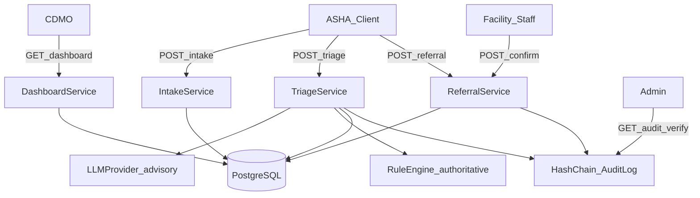

# SwasthyaSetu AI — Backend Architecture

## System Context

ASHA workers (and secondary clinical roles) interact with the backend via a future PWA or API clients. The backend is the **central control/orchestration plane**: workflow, routing, notifications, and audit. Patient records for MVP live in PostgreSQL owned by this service (facility-local federation is Tier 3 simulation / future distributed data plane).

## Components

| Component | Responsibility |
|---|---|
| FastAPI API (`/api/v1`) | HTTP, validation, auth dependencies |
| Application services | Domain workflows (intake, triage, referral, sync, dashboard) |
| Repositories | SQLAlchemy data access |
| Rule engine | Authoritative red-flag / risk decisions |
| LLM provider adapter | Advisory extraction only |
| Hash-chain audit | Tamper-evident event log |
| Integration adapters | Tier 2 simulated ABHA / eSanjeevani / 108 |
| Flower FL script | Tier 3 small simulation |

## Data Flow (protected demo path)



## Database

PostgreSQL with JSONB for structured symptoms. Alembic migrations only (no production `create_all`).

## AI Layer

```text
API → TriageService → LLMProvider.extract() → RuleEngine.classify()
                              ↓                         ↓
                     structured summary          final risk_level + source
```

LLM never sets final safety decision when rules fire red-flag. On LLM failure, rules still run.

## Queue

None in MVP. Offline sync is synchronous batch ingest with idempotency keys.

## Security

JWT access tokens, Argon2 password hashes, RBAC on every mutating clinical endpoint. Authorization on backend only.

## Integrations

Simulated only — write `IntegrationEvent` + audit entry.

## Deployment

Docker Compose: `postgres` + `backend`. See [`DEPLOYMENT.md`](DEPLOYMENT.md).

---

## Architecture Decision Records

### ADR-001: Single FastAPI service (no Node microservice)

- **Context:** Charter mentions FastAPI and Node.js.
- **Options:** Split microservices vs monolith for MVP.
- **Chosen:** Single FastAPI app.
- **Reason:** MVP API surface is small; split adds ops cost without Tier 1 value.
- **Trade-off:** Future extract of workers/services if scale requires.
- **Migration:** Extract domains behind same HTTP contracts.

### ADR-002: No Redis/Celery in MVP

- **Context:** Charter lists Redis for event queue.
- **Chosen:** Omit until long-running jobs exist.
- **Reason:** Triage is sync (&lt;5s target); offline sync is batch POST.
- **Migration:** Add Redis + worker when ASR batch or FL training is server-side.

### ADR-003: PostgreSQL hash-chain (not blockchain)

- **Context:** Trust layer requirement.
- **Chosen:** SHA-256 chained `AuditLog` rows.
- **Reason:** Charter Tier 1: signed hash-chain, not deployed ledger.
- **Trade-off:** Single-DB trust; permissioned ledger remains roadmap.

### ADR-004: LLM advisory + rule authority

- **Context:** Safety-critical triage.
- **Chosen:** Provider adapter for extraction; rules own red-flag.
- **Reason:** Defendable clinical safety claim.

### ADR-005: pgvector not introduced

- **Context:** No RAG requirement in MVP charter APIs.
- **Chosen:** Skip vector DB.
- **Reason:** No document retrieval workflow in Tier 1.
